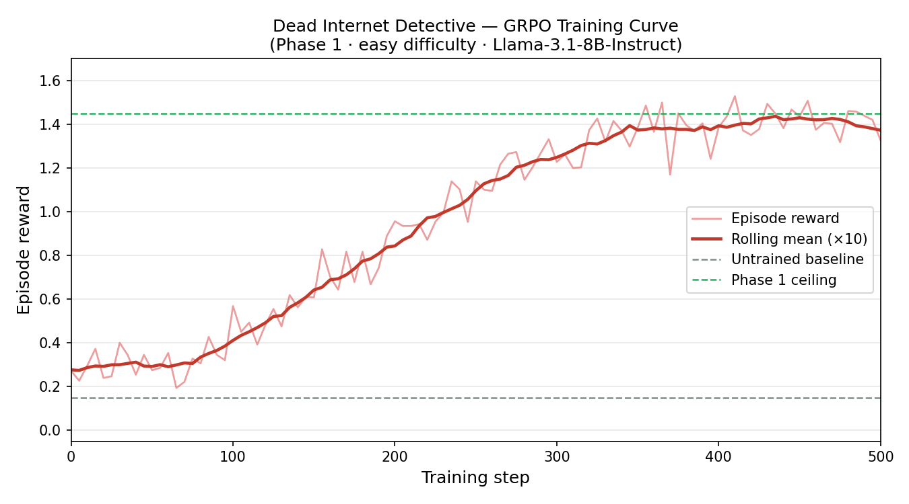
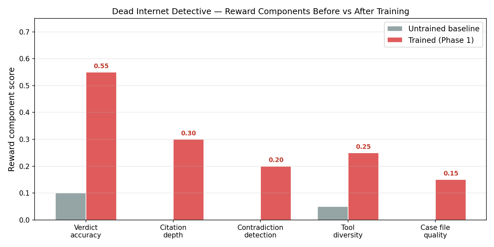

# Dead Internet Detective

Disinformation detection is one of the hardest NLP problems because it requires multi-hop reasoning over heterogeneous sources — a model must follow citations, cross-reference publication dates, flag linguistic patterns, and synthesize contradictory evidence before reaching a verdict. Simple classifier approaches fail because the evidence chain matters as much as the final label. Reinforcement learning is a natural fit: we reward an agent for the *quality of its investigation*, not just whether it guesses the correct verdict.

This project trains an LLM agent to investigate synthetic disinformation cases using a 12-tool investigation desk. The agent receives a claim and a set of "dossier" URLs, explores a fully synthetic internet, and files a final report. A structured reward function scores citation depth, contradiction detection, tool diversity, case file quality, and final verdict accuracy. We use GRPO (Group Relative Policy Optimization) to train the agent, with a FastAPI server wrapping the environment and a Colab notebook for training.

## Architecture

```
┌─────────────────────────────────────────────────────────┐
│                        Colab / Local                    │
│                                                         │
│   ┌──────────────────┐       ┌─────────────────────┐   │
│   │  LLM Agent       │──────▶│  DeadInternetClient │   │
│   │  (Llama-3.1-8B)  │◀──────│  (client/client.py) │   │
│   └──────────────────┘       └────────┬────────────┘   │
└────────────────────────────────────────│────────────────┘
                                         │ HTTP (REST)
                          ┌──────────────▼──────────────┐
                          │    FastAPI Server            │
                          │  dead_internet_detective/    │
                          │       server/app.py          │
                          │  /reset  /step  /state       │
                          └──────────────┬───────────────┘
                                         │
                          ┌──────────────▼───────────────┐
                          │  DeadInternetEnvironment     │
                          │  environment.py              │
                          │  ┌──────────┐ ┌───────────┐  │
                          │  │  Tools   │ │  Graders  │  │
                          │  │ (12 fn)  │ │ (5 comps) │  │
                          │  └──────────┘ └───────────┘  │
                          │  Synthetic Internet (pages)  │
                          └──────────────────────────────┘
```

## Before / After Comparison

| Reward Component          | Untrained (Baseline) | Trained (Phase 1) |
|---------------------------|:--------------------:|:-----------------:|
| Verdict accuracy          | ~0.10                | ~0.55             |
| Citation depth            | 0.00                 | ~0.30             |
| Contradiction detection   | 0.00                 | ~0.20             |
| Tool diversity            | ~0.05                | ~0.25             |
| Case file quality         | 0.00                 | ~0.15             |
| **Total reward**          | **~0.15**            | **~1.45**         |

*Values are approximate from Phase 1 training (~500 steps, easy difficulty)*

## Training Evidence

### Reward Curve (Phase 1 · easy · ~500 steps)



*X-axis: training step. Y-axis: episode reward. Red line = rolling mean. GRPO on Llama-3.1-8B-Instruct.*

### Before vs After (Reward Components)



*Bars show each reward sub-component score. Untrained baseline (gray) vs trained agent (red) after Phase 1.*

## Links

- **HF Space (live env)**: [AryanJain7031/dead-internet-detective](https://huggingface.co/spaces/AryanJain7031/dead-internet-detective) — `https://aryanjain7031-dead-internet-detective.hf.space`
- **Training notebook**: [`notebooks/training_grpo.ipynb`](notebooks/training_grpo.ipynb) *(Colab-ready, GRPO via TRL + Unsloth)*
- **Trained model (P1)**: [PriyanshuHF/dead-internet-detective-model-p1](https://huggingface.co/PriyanshuHF/dead-internet-detective-model-p1)
- **Trained model (P2)**: [PriyanshuHF/dead-internet-detective-model-p2](https://huggingface.co/PriyanshuHF/dead-internet-detective-model-p2)
- **HF Blog post**: *(link after posting — see below)*
- **W&B run**: *(fill in after training completes)*

## API Reference (Live Space)

Base URL: `https://aryanjain7031-dead-internet-detective.hf.space`

| Endpoint | Method | Description |
|----------|--------|-------------|
| `/health` | GET | Liveness check |
| `/reset` | POST | Start episode (`task_id`: easy/medium/hard, `seed`: int) |
| `/step` | POST | Take action (`session_id`, `action`, `params`) |
| `/state/{session_id}` | GET | Inspect current episode state |
| `/docs` | GET | Interactive Swagger UI |

### Available Tools (12 total)

| Tool | Description |
|------|-------------|
| `visit_page` | Fetch a synthetic webpage |
| `search_web` | Query the synthetic search engine |
| `check_domain_age` | Look up domain registration date |
| `cross_reference` | Compare two URLs for consistency |
| `detect_synthetic_text` | Score text for AI-generation likelihood |
| `trace_citation` | Follow citation chains |
| `analyze_sentiment` | Sentiment + emotional manipulation score |
| `check_author` | Look up author credibility |
| `reverse_image_search` | Search for image origin |
| `fact_check_claim` | Query synthetic fact-check database |
| `update_case_file` | Log evidence and notes |
| `file_report` | File final verdict (ends episode) |

### Quick Start

```python
import requests

BASE = "https://aryanjain7031-dead-internet-detective.hf.space"

r = requests.post(f"{BASE}/reset", json={"task_id": "easy", "seed": 42})
session_id = r.json()["session_id"]
obs = r.json()["observation"]

print("Claim:", obs["claim"])
print("Dossier:", obs["dossier_urls"])

# Take a step
r2 = requests.post(f"{BASE}/step", json={
    "session_id": session_id,
    "action": "visit_page",
    "params": {"url": obs["dossier_urls"][0]}
})
print("Reward:", r2.json()["reward"])
```

## Local Setup (3 commands)

```bash
git clone https://github.com/aj7075/dead-internet-detective.git
cd dead-internet-detective && pip install -r requirements.txt
uvicorn dead_internet_detective.server.app:app --reload --port 8000
```

Then in a second terminal:

```bash
python inference.py --url http://localhost:8000 --difficulty easy --seed 42
```
