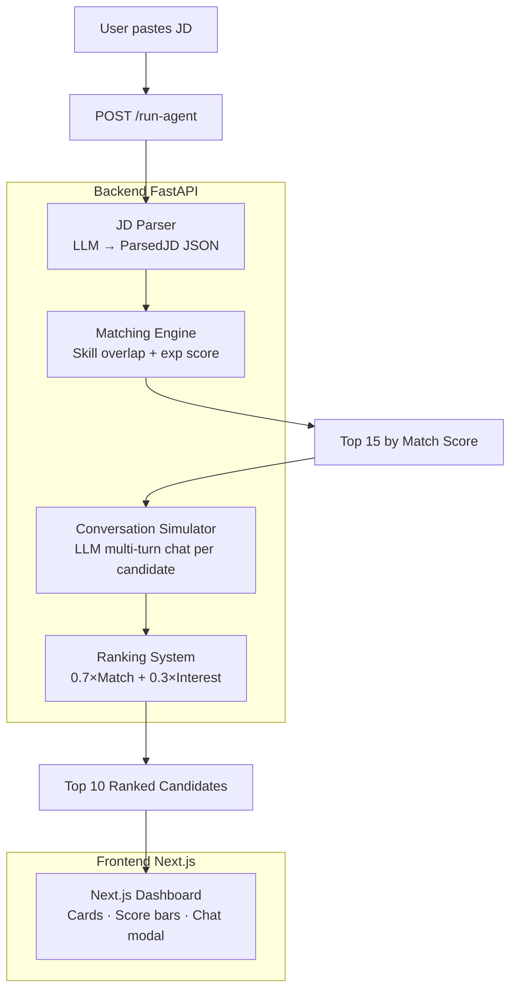

# 🎯 Talent Scout AI

AI-powered recruiter agent — paste a Job Description, get a ranked shortlist of candidates with match scores, conversation simulations, and explanations.

---

## Architecture



---

## Folder Structure

```
talent-scout/
├── backend/
│   ├── main.py                  # FastAPI app + endpoints
│   ├── models.py                # Pydantic schemas
│   ├── llm_client.py            # OpenAI-compatible LLM abstraction
│   ├── jd_parser.py             # LLM-powered JD parser
│   ├── matching_engine.py       # Skill + experience scoring
│   ├── conversation_simulator.py# Multi-turn chat simulation
│   ├── ranking.py               # Final scoring + tag generation
│   ├── requirements.txt
│   ├── .env.example
│   └── data/
│       └── candidates.json      # 35 synthetic candidates
└── frontend/
    ├── app/
    │   ├── layout.tsx
    │   ├── page.tsx             # Main dashboard
    │   ├── globals.css
    │   └── types.ts
    ├── components/
    │   ├── JDInput.tsx          # JD textarea + demo loader
    │   ├── CandidateCard.tsx    # Ranked result card
    │   ├── ScoreBar.tsx         # Animated progress bar
    │   └── ChatModal.tsx        # Conversation preview popup
    ├── package.json
    ├── next.config.js
    ├── tailwind.config.js
    └── tsconfig.json
```

---

## Quick Start (< 10 minutes)

### Prerequisites
- Python 3.10+
- Node.js 18+
- An OpenAI API key (or set `USE_MOCK_LLM=true` to test without one)

---

### 1. Backend

```bash
cd talent-scout/backend

# Create virtualenv
python -m venv venv
source venv/bin/activate        # Windows: venv\Scripts\activate

# Install deps
pip install -r requirements.txt

# Configure env
cp .env.example .env
# Edit .env → set OPENAI_API_KEY=sk-...
# OR set USE_MOCK_LLM=true for offline demo

# Start server
python main.py
# → http://localhost:8000
```

### 2. Frontend

```bash
cd talent-scout/frontend

npm install
# Set API URL if backend is not on port 8000:
# NEXT_PUBLIC_API_URL=http://localhost:8000

npm run dev
# → http://localhost:3000
```

---

## Mock Mode (no API key)

In `backend/.env`:
```
USE_MOCK_LLM=true
```

The mock returns pre-baked JD parse results and recruiter replies — instant, no cost, good for UI demos.

---

## API Reference

| Endpoint | Method | Description |
|---|---|---|
| `/` | GET | Health check |
| `/candidates` | GET | All candidates in dataset |
| `/parse-jd` | POST | Parse raw JD text → structured JSON |
| `/run-agent` | POST | Full pipeline: parse → match → converse → rank |

### POST /run-agent

Request:
```json
{
  "jd_text": "Senior Backend Engineer...",
  "top_k": 10
}
```

Response: see **Sample Output** below.

---

## Using an Alternative LLM

Set env vars to point at any OpenAI-compatible endpoint:

```bash
OPENAI_BASE_URL=https://api.groq.com/openai/v1
OPENAI_API_KEY=gsk_your_groq_key
LLM_MODEL=llama3-8b-8192
```

Works with: Groq, Together AI, Ollama (local), Azure OpenAI, Anyscale.

---

## Scoring Formula

```
Match Score   = (required_skill_overlap × 60) + (preferred_skill_overlap × 20) + experience_fit × 20
Interest Score = derived from per-turn intent classification (positive/neutral/negative)
Final Score   = 0.7 × Match Score + 0.3 × Interest Score
```

---

## Sample Output

```json
{
  "parsed_jd": {
    "role": "Senior Backend Engineer",
    "required_skills": ["Python", "FastAPI", "PostgreSQL", "Docker", "AWS"],
    "preferred_skills": ["Kubernetes", "Redis"],
    "experience_level": "Senior",
    "min_years": 4,
    "max_years": 8
  },
  "total_candidates_evaluated": 35,
  "ranked_candidates": [
    {
      "candidate": {
        "id": "c001",
        "name": "Aisha Patel",
        "experience": 6,
        "location": "San Francisco, CA"
      },
      "match_score": 92.0,
      "interest_score": 87.5,
      "final_score": 90.7,
      "matched_skills": ["python", "fastapi", "postgresql", "docker", "aws", "redis"],
      "missing_skills": [],
      "match_explanation": "Aisha matches all required skills and has fintech experience directly relevant to the payments domain. Her 6 years of experience falls squarely in the senior band.",
      "intent": "High",
      "conversation_summary": "Aisha expressed strong interest in the role, confirmed she is open to work, and asked thoughtful questions about tech stack and team structure.",
      "tags": ["🔥 High Intent", "✅ Strong Match", "🟢 Open to Work", "⚡ Fast Responder"],
      "why_this_candidate": "Aisha brings a rare combination of fintech domain expertise and a complete skill match — she has shipped production FastAPI + PostgreSQL systems at Stripe scale. Her high responsiveness and open-to-work status make her an immediate priority.",
      "messages": [
        {"role": "recruiter", "content": "Hi Aisha! I came across your profile..."},
        {"role": "candidate", "content": "Thanks for reaching out! This sounds like a great fit..."}
      ]
    }
  ]
}
```

---

## Tags Explained

| Tag | Meaning |
|---|---|
| 🔥 High Intent | Candidate showed positive engagement in simulated conversation |
| ✅ Strong Match | Match score ≥ 80 |
| ⚠️ Skill Gap | Has missing required skills |
| 🟢 Open to Work | `open_to_work: true` in dataset |
| ⚡ Fast Responder | `responsiveness: high` in dataset |
| ❄️ Low Interest | Candidate showed low engagement |
